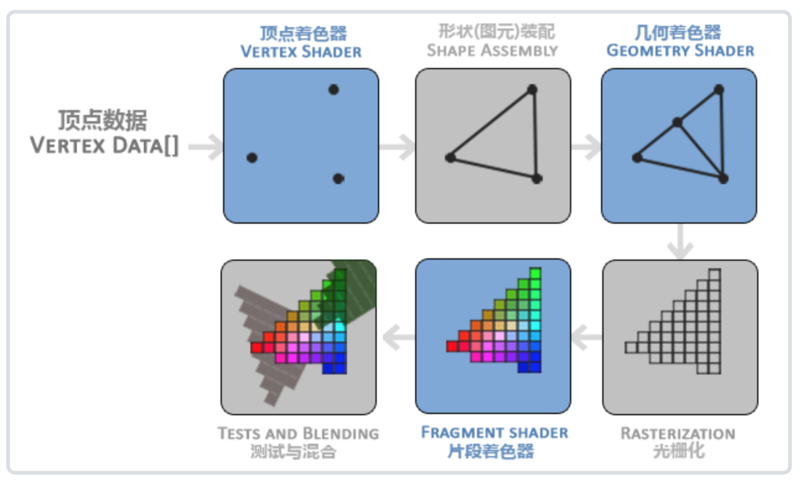

### Android OpenGL

#### 1. 配置环境


- 在 `manifest`文件里做如下配置
	``` <uses-feature android:glEsVersion="0x00020000"  android:required="true"/>```
	
	- glEsVersion 支持的OpenGL版本号
	  
- 自定义 ``` MySurfaceView ``` 继承 ``` GLSurfaceView ```

- 自定义 ``` MyRender ``` 实现 ``` GLSurfaceView.Renderer ```
 
  ```
  public class MyRender implements GLSurfaceView.Renderer {
    
      @Override
      public void onSurfaceCreated(GL10 gl, EGLConfig config) {
          GLES20.glClearColor(0f, 0f, 0f, 1f);
       

      }

      @Override
      public void onSurfaceChanged(GL10 gl, int width, int height) {
          GLES20.glViewport(0, 0, width, height);
      }

      @Override
      public void onDrawFrame(GL10 gl) {
          GLES20.glClear(GLES20.GL_COLOR_BUFFER_BIT);
      
      }
 }
  
  ```
- 在 ``` MySurfaceView ``` 中使用 ``` MyRender  ```
  
  ```
  public class MySurfaceView extends GLSurfaceView {
      MyRender myRender;
      public MySurfaceView(Context context) {
        this(context, null);
      }

      public MySurfaceView(Context context, AttributeSet attrs) {
        super(context, attrs);

        init();
      }


      public void init() {
        setEGLContextClientVersion(2);
        myRender = new MyRender();
        setRenderer(myRender);
        setRenderMode(GLSurfaceView.RENDERMODE_WHEN_DIRTY);
      }
}
  ```
    - setRenderMode 
     - `RENDERMODE_CONTINUOUSLY 1` 反复调用渲染器渲染场景
     - `RENDERMODE_WHEN_DIRTY 0` 只在 Surface 创建的时或者调用 requestRender 时渲染场景

- 在 Activity 中使用
   
  ```
     <com.example.cuifeifei.myapplication.view.MySurfaceView
        android:id="@+id/gl_surfaceview"
        android:layout_width="match_parent"
        android:layout_height="match_parent" />
  ```
  
### 2. OpenGL 基本概念
  
#### 2.1 VAO、VBO、EBO
 - VAO 顶点数组对象，用来表示顶点坐标的数组
 - VBO 顶点缓冲对象，OpenGL 用来缓存顶点数组
 - EBO 索引缓冲对象，当绘制图形的时候往往会有重复的顶点，为了不存储多余的重复的顶点。在绘制的时候给出要绘制的顶点的索引，按照索引进行绘制。存储顶点索引的数组就是索引缓冲对象。
   
    
    
    
#### 2.2 着色器 Sharder
OpenGL 为了把3D坐标转换成2D图像，会对坐标数据进行一系列的处理。这一系列的处理分为好几个阶段，每个阶段都运行着自己的小程序。这些小程序就是着色器。有些小程序允许运行开发者配置的。现代OpenGL要求必须有一个顶点着色器和一个片段着色器。


  
  - 顶点着色器 Vertex Sharder
  - 片段着色器 Fragment Sharder


#### 2.3 OpenGL 着色器语言 GLSL

编写着色器的语言就是 GLSL，类C

```
 attribute vec4 vPosition;
 precision mediump float;
 attribute vec3 vColor;
 varying vec3 ourColor;
 void main() {
    gl_Position = vPosition;
    ourColor = vColor;
 }
```  
- attribute 变量修饰符，表示输入变量
- varying 变量修饰符，表示输出变量
- precision mediump float 精度声明
- gl_Position OpenGL ES 内置变量

### 3 三角形

OpenGL 中基本的图像是三角形和点。画三角形的步骤

- 定义顶点坐标
- 定义三角形颜色
- 编写顶点着色器和片段着色器
- 编译连接使用着色器程序
- 绑定顶点坐标到 VBO
- 连接顶点属性
- 执行画三角方法

#### 3.1 顶点坐标和三角形颜色
- 顶点坐标是3D坐标
- 颜色格式ARGB

```
float[] triangleCoords = {0.5f, 0.5f, 0f,
                        - 0.5f, 0.5f, 0f,
                            0f, -0.5f, 0f};
                            
 float[] colors = {1f, 0f, 0f, 1f};                  
                            
```

#### 3.3 使用着色器

1. 顶点着色器


  ```
      String vertexShaderCode2 =
                "attribute vec4 vPosition;" +
                        "precision mediump float;" +
                        "void main() {" +
                        "gl_Position = vPosition;" +
                        "}";
  ```


2. 片段着色器

  ```
    String fragmentShaderStr = "precision mediump float;" +
                "uniform vec4 color;" +
                "void main() {" +
                "gl_FragColor = color;" +
                "}";
  ```
  
3. 加载着色器

   ```
     int shader = GLES20.glCreateShader(type);
     GLES20.glShaderSource(shader, sharderCode);
     GLES20.glCompileShader(shader);
   ```

4. 着色器程序

   ```
    program = GLES20.glCreateProgram(); \\ 创建着色器程序
    GLES20.glAttachShader(program, vertexShader); \\ attach 着色器
    GLES20.glAttachShader(program, fragmentShader);
    GLES20.glLinkProgram(program); \\ 连接着色器程序
    GLES20.glUseProgram(program);  \\ 使用着色器程序
   ```
   

#### 3.2 绑定数据

1. 加载数据

  ```
   ByteBuffer byteBuffer1 = ByteBuffer.allocateDirect(triangleCoords.length *4);
   byteBuffer1.order(ByteOrder.nativeOrder());
   FloatBuffer floatBuffer1 = byteBuffer1.asFloatBuffer();
   floatBuffer1.put(triangleCoords);
   floatBuffer1.position(0);
        
   IntBuffer intBuffer = IntBuffer.allocate(1);
   GLES30.glGenBuffers(1, intBuffer);
   GLES30.glBindBuffer(GLES20.GL_ARRAY_BUFFER, intBuffer.get(0));
   GLES30.glBufferData(GLES20.GL_ARRAY_BUFFER, byteBuffer1.capacity(),   floatBuffer1, GLES20.GL_STATIC_DRAW);
   
  ```
  - GLES30.glGenBuffers(int n,java.nio.IntBuffer buffers); 申请 VBO ，n 是申请数量，buffers 存放 VBO首地址的数组
  - GLES30.glBindBuffer(int target,int buffer); target 缓冲对象的类型，VBO 的是 GLES20.GL\_ARRAY_BUFFER。
  - GLES30.glBufferData(int target,int size, java.nio.Buffer data, int usage），size 数据的大小以字节为单位，useage 数据的管理方式，GL\_STATIC\_DRAW 数据不会或者几乎不会改变；GL\_DYNAMIC\_DRAW 数据会被改变很多；GL\_STREAM\_DRAW 数据每次绘制都会改变
  
  
2. 解释数据


  ```
     int handlePosition = GLES20.glGetAttribLocation(program, "vPosition");
     GLES20.glEnableVertexAttribArray(handlePosition);
     GLES20.glVertexAttribPointer(handlePosition, 3, GLES20.GL_FLOAT, false, 3 * 4, 0);
     int handleColor = GLES20.glGetUniformLocation(program, "color");
     GLES20.glUniform4fv(handleColor, 1, colors, 0);
  ```
  由于一个着色器可能有多个输入属性，这些输入属性都可以使用顶点数组对象方式输入，所以我们要告诉着色器怎么去将顶点数组对象里的数据正确的赋值给相应的属性。
  - GLES20.glGetAttribLocation(program, "vPosition"); 获取对应属性这里是 `vPosition ` 的位置。
  - GLES20.glEnableVertexAttribArray(handlePosition);
    启用顶点属性
  - GLES20.glVertexAttribPointer( int indx,
        int size,
        int type,
        boolean normalized,
        int stride,
        int offset);
      - index 顶点属性的位置通过 GLES20.glGetAttribLocation 拿到的
      - size 属性的大小，如果是坐标的话是 3 （x,y,z）
      - type 指定数据类型
      - normalized 是否希望数据被标准化，true 数据会被映射到 0 -1之间
      - stride 步长，
      - offset 偏移量
  
  
#### 3.3 执行绘制

  ```
    GLES20.glDrawArrays(GLES20.GL_TRIANGLES, 0, 3);
  ```   
   GLES20.glDrawArrays( int mode,
        int first,
        int count); 执行绘制
   
   - mode 绘制的类型，
      - GL\_TRIANGLE\_FAN 三角形
      - GL_LINES 线
      - GL_POINTS 点
   - first 顶点数组的开始索引
   - count 绘制的顶点个数


  
  
  
  
  
  
  
  
  
  
  
  
  
  
  
  
  
  


